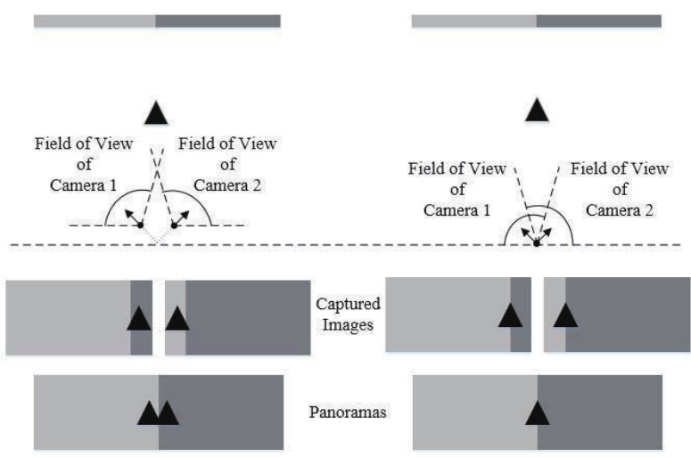
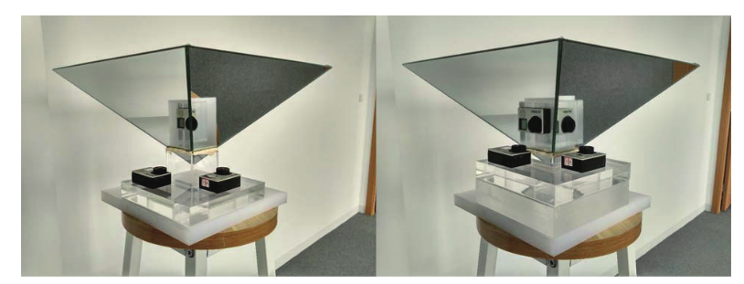
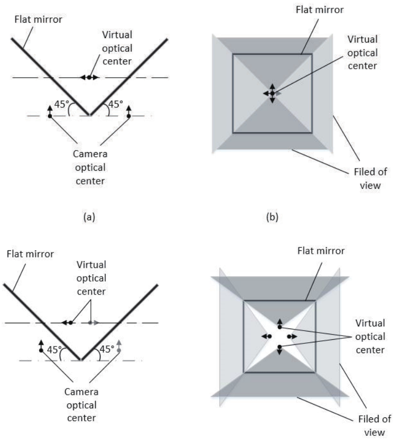
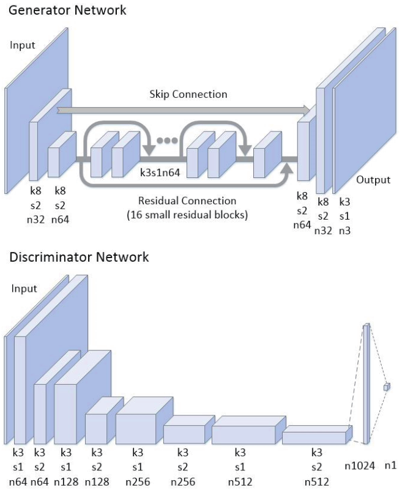

# Real-Time Image Stitching with Convolutional Neural Networks
## 主要创新点
**针对深度学习在图像拼接领域缺少真实标签数据集的情况，提出了一种获取真实标签(真实拼接图像)的方法，同时采用GAN(对抗生成网络)进行后处理，消除重影。**
> 1. 提出监督学习数据集的生成方法——利用平面镜使得照相机的光心可以调节。
> 2. 提出PanoGAN网络来消除重影——最后用PSNR指标来衡量去重影的效果。

## 主要步骤
### 数据准备(数据集没公开)
本文主要基于如下两个假设(观察)来制作数据集： 
1. 相机的光轴会相交，并且交点与两个相机的光心距离不远。
2. 沿着光轴移动一点距离对拍摄内容几乎没有影响。

为了获取图像的方便，本文使用平面镜构建了一个拍摄系统： 

- 平面镜与水平面成45°，这样当两个相机的光心放在锥体顶点所在的水平面且距离顶点的距离一样时，通过平面镜的反射，虚拟光心会重合。
- 当需要拍摄无有视差的图像时，只需要将相机往上移动即可。

### PanoGAN去除重影

**Input** 
输入的是7通道图像，两幅warp后的RGB图像+代表重叠区域*binary mask*

**Generator** 
*down sampling + residual block + up sampling*

**Discriminator** 
采用SRGAN中提出的Discriminator

**PS** 
GAN网络需要在后续进一步了解
### Loss function
**Percepture loss** 
采用SRGAN中的loss function
$$
\min_G=l_{VGG}+\lambda*l_{Adv}\\
        l_{VGG}=\frac{1}{whc}\sum_{x=0}^{w-1}\sum_{y=0}^{h-1}\sum_{z=0}^{c-1}(\phi(I^{GT}_{x,y,z})-\phi(G(I^{In}))_{x,y,z})^2\\
        l_{Adv}=\frac{1}{2}E[(D(G(I^{In}))- 1)^2]
$$
**Dicriminator loss**
$$
\min_D=\frac{1}{2}E[(D(I^{GT}) - 1)^2]+\frac{1}{2}E[(D(I^{In}) - 0)^2]
$$
**pre_train generator loss** 
这是预训练generator时使用的MSE loss
$$
l_{MSE}=\frac{1}{whc}\sum_{x=0}^{w-1}\sum_{y=0}^{h-1}\sum_{z=0}^{c-1}(I^{GT}_{x,y,z}-G(I^{In})_{x,y,z})^2
$$
### 评价指标
**PSNR(Peak Signal to Noise Ratio)** 
用来评价输出的结果与GT之间的误差：
$$
MSE=\frac{1}{whc}\sum_{x=0}^{w-1}\sum_{y=0}^{h-1}\sum_{z=0}^{c-1}(I(x,y,z)-GT(x,y,z))^2
$$
## 总结
1. 这篇文章的可取之处是得到了一个真实的拼接数据集，但居然没有公开！！！！！
2. 文章说实话有点扯……不少细节没说清楚，建议不用看了，只要知道他如何构建数据库就行。
